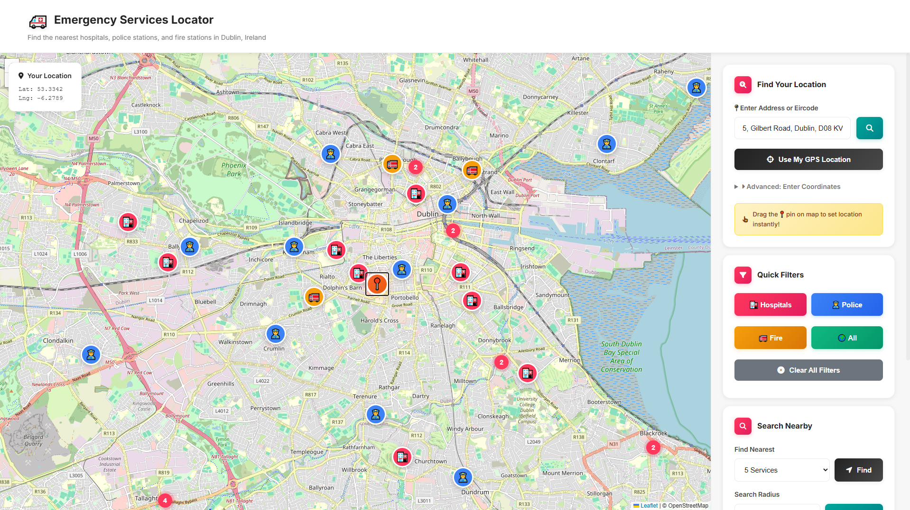
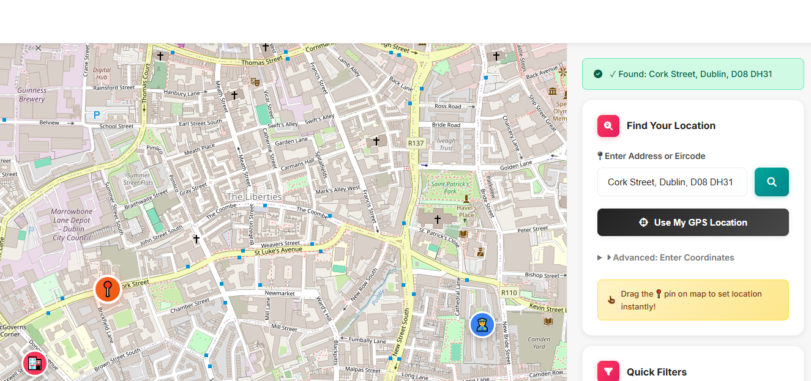
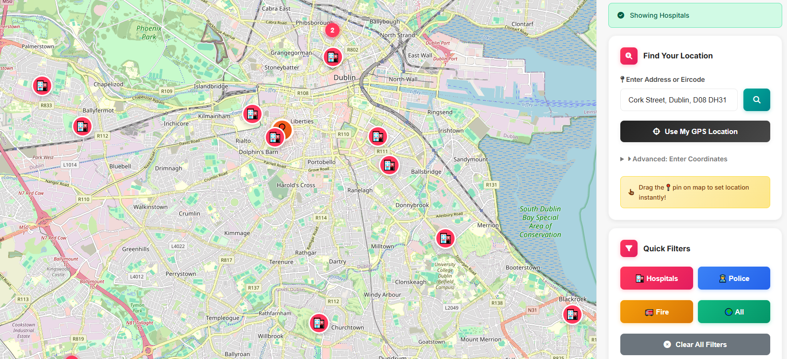
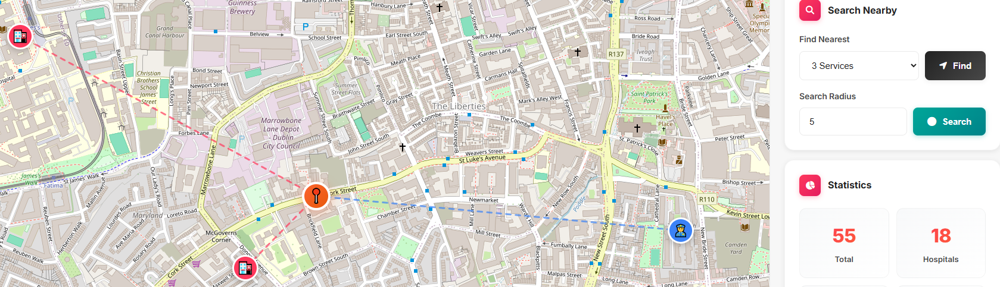
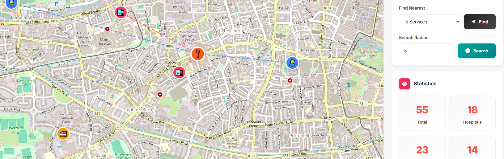
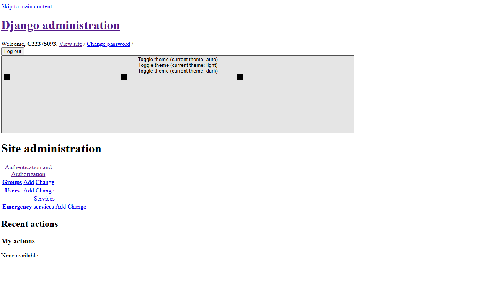
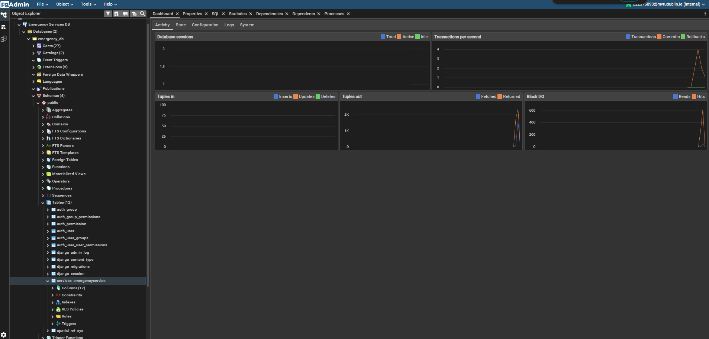
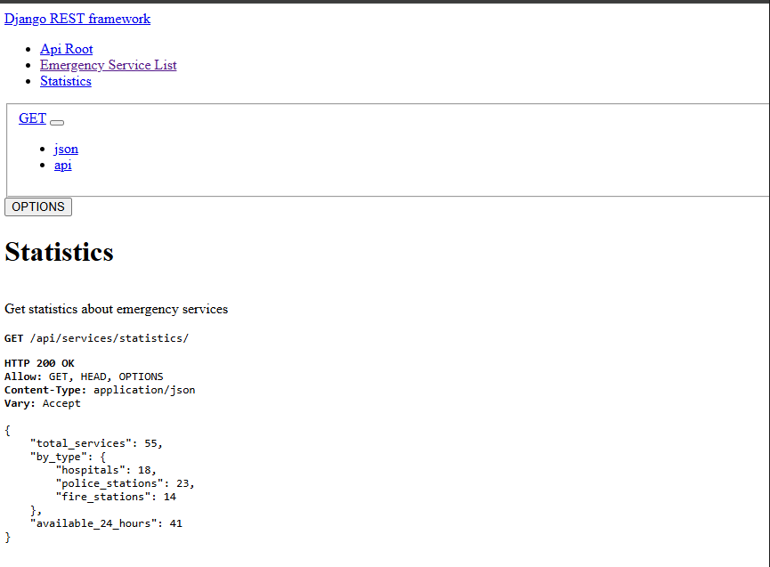
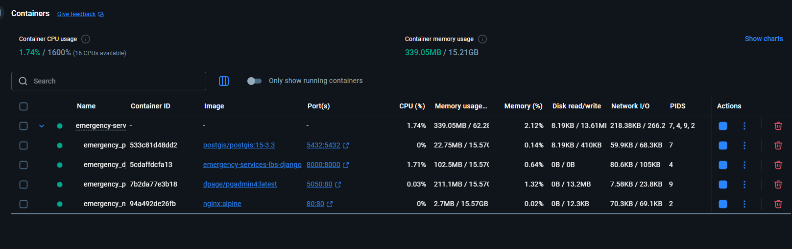

# 🏥 Emergency Services Locator - Dublin

A location-based services (LBS) web application for finding emergency services (hospitals, police stations, and fire stations) in Dublin, Ireland. Built with Django, PostGIS, and Leaflet.js.


---

## 📸 Screenshots

### Main Application Interface


*Interactive map displaying all 15 emergency services across Dublin with real-time filtering, search capabilities, and statistics dashboard*

---

### Location Search Functionality


*Address and Eircode geocoding with support for Dublin addresses and Irish postal codes*

---

### Service Type Filtering


*Dynamic filtering to show only hospitals, police stations, or fire stations with live marker updates*

---

### Radius Search with Spatial Query


*PostGIS ST_DWithin spatial query showing all services within a specified radius with visual circle overlay*

---

### Nearest Services Query


*PostGIS distance calculation showing the 5 nearest emergency services with exact distances using ST_Distance function*

---

### Django Administration Interface


*GeoDjango admin interface with interactive map widget for managing spatial data and CRUD operations*

---

### Database Management with PgAdmin


*PgAdmin4 interface showing PostgreSQL 15 database with PostGIS 3.3 extension and spatial data tables*

---

### RESTful API Response


*RESTful API endpoint returning JSON data with spatial query results and GeoJSON support*

---

### Mobile Responsive Design


*Responsive layout adapting to mobile devices with touch-optimized controls and stacked interface*

---

### Docker Containers Running



*Four Docker containers orchestrated with Docker Compose on custom network for development and deployment*

---

## 🎯 Features

### Core Functionality
- **Interactive Map**: Leaflet.js-powered map with OpenStreetMap tiles centered on Dublin
- **Multiple Service Types**: Hospitals , Police Stations , and Fire Stations
- **Real-time Filtering**: Filter services by type with instant map updates
- **User Location**: Click anywhere on map, use GPS, or search by address/Eircode
- **Responsive Design**: Works seamlessly on desktop (1920px), tablet (768px), and mobile (375px) devices

### Spatial Queries (PostGIS)
1. **Nearest Neighbor Search** - Find N closest emergency services using `ST_Distance` with distance annotation and ordering
2. **Radius Search** - Find all services within X kilometers using `ST_DWithin` spatial function with visual circle overlay
3. **Type-Based Distance Query** - Filter by service type with calculated distances from user location

### Additional Features
- **Statistics Dashboard**: Real-time counts showing total services by type (hospitals, police, fire stations)
- **Visual Indicators**: Custom map markers with emoji icons for each service type
- **Popup Information**: Detailed service information windows with contact details and availability
- **Distance Calculation**: Accurate distance display in kilometers for all search results
- **24-Hour Availability**: Visual indicators showing which services operate 24/7
- **Marker Clustering**: Automatic grouping of nearby markers for better performance and clarity
- **Geocoding Support**: Search by full address or Irish Eircode (e.g., "D08 R77K")
- **Reverse Geocoding**: Automatic address lookup when clicking on map
- **GPS Geolocation**: Browser-based location detection with fallback

---

## 🛠️ Technology Stack

### Backend
- **Framework**: Django 4.2.7 (Python 3.11)
- **Database**: PostgreSQL 15 with PostGIS 3.3 extension
- **API**: Django REST Framework 3.14.0
- **GIS**: GeoDjango with spatial database support
- **Architecture**: Model-View-Controller (MVC) pattern
- **Serialization**: GeoJSON support via djangorestframework-gis

### Frontend
- **Framework**: Custom CSS (Bootstrap 5 inspired)
- **Mapping**: Leaflet.js 1.9.4
- **Clustering**: Leaflet.markercluster 1.4.1
- **Tiles**: OpenStreetMap
- **Icons**: Font Awesome 6.4.0
- **Fonts**: Google Fonts (Inter)
- **JavaScript**: Vanilla ES6+ (no jQuery)

### Deployment
- **Containerization**: Docker & Docker Compose
- **Web Server**: Nginx (reverse proxy)
- **Database Admin**: PgAdmin 4
- **Network**: Custom isolated Docker bridge network (172.25.0.0/16)
- **Environment**: Configuration via .env file

### Development Tools
- **Version Control**: Git
- **API Testing**: Django REST Framework browsable API
- **Database GUI**: PgAdmin 4
- **Code Editor**: Any (VS Code recommended)

---

## 📋 Prerequisites

### For Docker Deployment (Recommended)
- Docker Desktop 20.10+ or Docker Engine 20.10+
- Docker Compose 2.0+
- 4GB RAM minimum
- 10GB free disk space

### For Local Development
- Python 3.11+
- PostgreSQL 15+ with PostGIS 3.3+
- pip and virtualenv
- Git

---

## 🚀 Quick Start (Docker - Recommended)

### 1. Clone the Repository
```bash
git clone https://github.com/Riovo/Emergency-Services-Locator
cd emergency-services-lbs
```

### 2. Environment Configuration
The `.env` file is already configured with default values. For production, update:
```env
DATABASE_NAME=emergency_db
DATABASE_USER=postgres
DATABASE_PASSWORD=postgres123
DATABASE_HOST=postgis
DATABASE_PORT=5432
DJANGO_SECRET_KEY=your-secret-key-here
DEBUG=False
```

### 3. Start All Services
```bash
docker-compose up --build
```

This will:
- Create PostgreSQL 15 database with PostGIS 3.3
- Set up PgAdmin4 for database management
- Build and run Django application
- Configure Nginx reverse proxy
- Load sample data (55 emergency services in Dublin)
- Create superuser automatically

**Wait for**: `Starting development server at http://0.0.0.0:8000/`

### 4. Access the Application

| Service | URL | 
|---------|-----|
| **Main Application** | http://localhost |
| **Django Admin** | http://localhost/admin | 
| **PgAdmin4** | http://localhost:5050 |
| **API Root** | http://localhost/api/services/ |

### 5. Stop Services
```bash
# Stop containers (preserves data)
docker-compose stop

# Stop and remove containers (keeps volumes/data)
docker-compose down

# Remove everything including data (CAUTION)
docker-compose down -v
```

---

## 🔧 Local Development Setup (Without Docker)

### 1. Install PostgreSQL with PostGIS

**Ubuntu/Debian:**
```bash
sudo apt-get update
sudo apt-get install postgresql postgresql-contrib postgis postgresql-15-postgis-3
```

**macOS (Homebrew):**
```bash
brew install postgresql postgis
brew services start postgresql
```

**Windows:**
- Download PostgreSQL 15 from [postgresql.org](https://www.postgresql.org/download/windows/)
- Enable PostGIS during installation or install separately

### 2. Create Database
```bash
sudo -u postgres psql

CREATE DATABASE emergency_db;
\c emergency_db
CREATE EXTENSION postgis;
\q
```

### 3. Set Up Python Environment
```bash
cd backend
python3 -m venv venv

# Activate virtual environment
source venv/bin/activate  # Linux/macOS
# OR
venv\Scripts\activate     # Windows

# Install dependencies
pip install --upgrade pip
pip install -r requirements.txt
```

### 4. Configure Environment Variables
Create `.env` file in `backend/` directory:
```env
DATABASE_NAME=emergency_db
DATABASE_USER=postgres
DATABASE_PASSWORD=your_password
DATABASE_HOST=localhost
DATABASE_PORT=5432
DJANGO_SECRET_KEY=your-secret-key-here
DEBUG=True
```

### 5. Run Migrations and Load Data
```bash
python manage.py migrate
python manage.py loaddata services/fixtures/initial_data.json
python create_superuser.py
```

### 6. Run Development Server
```bash
python manage.py runserver
```

Access at: http://localhost:8000

---

## 📡 API Documentation

### Base URL
```
http://localhost/api/services/
```

### Endpoints

#### 1. List All Services
```http
GET /api/services/
GET /api/services/?type=hospital
GET /api/services/?type=police
GET /api/services/?type=fire
```

**Response:**
```json
[
  {
    "id": 1,
    "name": "St. James's Hospital",
    "service_type": "hospital",
    "address": "James's Street, Dublin 8, D08 NHY1",
    "phone": "+353 1 410 3000",
    "email": "info@stjames.ie",
    "latitude": 53.3420,
    "longitude": -6.2950,
    "capacity": 1000,
    "is_24_hours": true,
    "description": "Major teaching hospital in Dublin 8"
  }
]
```

#### 2. Get Service Details
```http
GET /api/services/{id}/
```

#### 3. Find Nearest Services (Spatial Query 1)
```http
GET /api/services/nearest/?lat=53.3498&lng=-6.2603&limit=5
GET /api/services/nearest/?lat=53.3498&lng=-6.2603&limit=5&type=hospital
```

**Parameters:**
- `lat` (required): Latitude
- `lng` (required): Longitude
- `limit` (optional): Number of results (default: 5)
- `type` (optional): Filter by service type

**Response:**
```json
{
  "user_location": {"lat": 53.3498, "lng": -6.2603},
  "count": 5,
  "services": [
    {
      "id": 1,
      "name": "St. James's Hospital",
      "service_type": "hospital",
      "address": "James's Street, Dublin 8",
      "phone": "+353 1 410 3000",
      "latitude": 53.3420,
      "longitude": -6.2950,
      "is_24_hours": true,
      "distance": {
        "m": 1245.67,
        "km": 1.25
      }
    }
  ]
}
```

#### 4. Services Within Radius (Spatial Query 2)
```http
GET /api/services/within_radius/?lat=53.3498&lng=-6.2603&radius=10
GET /api/services/within_radius/?lat=53.3498&lng=-6.2603&radius=5&type=police
```

**Parameters:**
- `lat` (required): Latitude
- `lng` (required): Longitude
- `radius` (required): Radius in kilometers
- `type` (optional): Filter by service type

**Response:**
```json
{
  "user_location": {"lat": 53.3498, "lng": -6.2603},
  "radius_km": 10,
  "count": 12,
  "services": [...]
}
```

#### 5. Services by Type with Distance (Spatial Query 3)
```http
GET /api/services/by_type/?lat=53.3498&lng=-6.2603&type=hospital
```

**Parameters:**
- `lat` (required): Latitude
- `lng` (required): Longitude
- `type` (required): Service type (hospital, police, fire)

#### 6. Statistics
```http
GET /api/services/statistics/
```

**Response:**
```json
{
  "total_services": 15,
  "by_type": {
    "hospitals": 5,
    "police_stations": 5,
    "fire_stations": 5
  },
  "available_24_hours": 15
}
```

### Example API Calls

```bash
# Get all hospitals
curl "http://localhost/api/services/?type=hospital"

# Find 5 nearest services from the campus
curl "http://localhost/api/services/nearest/?lat=53.3546&lng=-6.2816&limit=5"

# Services within 10km
curl "http://localhost/api/services/within_radius/?lat=53.3498&lng=-6.2603&radius=10"

# Get statistics
curl "http://localhost/api/services/statistics/"
```

## 🗄️ Database Schema

### EmergencyService Model

| Field | Type | Description | PostGIS |
|-------|------|-------------|---------|
| id | Integer | Primary key (auto) | - |
| name | CharField(200) | Service name | - |
| service_type | CharField(20) | Type: hospital, police, fire | - |
| address | CharField(300) | Full address | - |
| phone | CharField(20) | Contact phone | - |
| email | EmailField | Contact email | - |
| **location** | **PointField** | **Lat/Lng coordinates** | **✓ SRID 4326** |
| capacity | Integer | Bed capacity (hospitals) | - |
| is_24_hours | Boolean | 24-hour availability | - |
| description | TextField | Additional information | - |
| created_at | DateTime | Creation timestamp | - |
| updated_at | DateTime | Last update timestamp | - |

### Spatial Features
- **Coordinate System**: WGS84 (SRID 4326)
- **Spatial Index**: GiST index on `location` field for optimized spatial queries
- **Spatial Functions Used**:
  - `ST_Distance()` - Calculate distance between points
  - `ST_DWithin()` - Find points within radius
  - `Distance` annotation - Django ORM distance calculation

### Sample Data
The application includes 55 pre-loaded emergency services in Dublin
All with real Dublin addresses and accurate coordinates.

---

### Docker Network Architecture

```
┌──────────────────────────────────────────────────────────────────┐
│        Docker Bridge Network: emergency_network                  │
│                 Subnet: 172.25.0.0/16                            │
│                                                                  │
│  ┌──────────────┐  ┌──────────────┐  ┌──────────────┐          │
│  │   Nginx      │  │   Django     │  │   PostGIS    │          │
│  │   Container  │  │   Container  │  │   Container  │          │
│  │              │  │              │  │              │          │
│  │   Port: 80   │→ │  Port: 8000  │→ │  Port: 5432  │          │
│  │              │  │              │  │              │          │
│  │  Static files│  │  Django 4.2  │  │  PostgreSQL  │          │
│  │  Reverse     │  │  GeoDjango   │  │  15 + PostGIS│          │
│  │  proxy       │  │  DRF API     │  │  3.3         │          │
│  └──────────────┘  └──────────────┘  └──────┬───────┘          │
│                                              │                  │
│                     ┌────────────────────────┘                  │
│                     │                                           │
│              ┌──────▼────────┐                                  │
│              │   PgAdmin 4   │                                  │
│              │   Container   │                                  │
│              │               │                                  │
│              │  Port: 5050   │                                  │
│              │               │                                  │
│              │  DB GUI       │                                  │
│              └───────────────┘                                  │
│                                                                  │
│  Volumes:                                                        │
│  • postgis_data → /var/lib/postgresql/data                      │
│  • ./backend → /app (Django code)                               │
│  • ./nginx.conf → /etc/nginx/nginx.conf                         │
│  • ./backend/static → /static (static files)                    │
└──────────────────────────────────────────────────────────────────┘
                         ▲
                         │ Host machine
                         │ Ports: 80, 5050, 5432, 8000
```

## 📝 Known Issues & Limitations

### Current Limitations
- Sample data limited to Dublin area only
- Radius search limited to 50km maximum
- No real time traffic data integration
- Basic error handling
- Geocoding depends on external APIs - rate limits may apply

---

## 🧪 Testing

### Manual Testing Checklist
- [x] Map loads correctly with all tiles
- [x] All 55 service types display with correct icons
- [x] Click map updates user location marker
- [x] Filter by service type works (hospital, police, fire)
- [x] "Show All" resets filters properly
- [x] Nearest search returns correct results ordered by distance
- [x] Radius search displays circle and correct results
- [x] Statistics load and display correctly
- [x] Responsive design works on mobile (375px)
- [x] Responsive design works on tablet (768px)
- [x] API endpoints return valid JSON
- [x] Docker deployment successful
- [x] PgAdmin connects to database
- [x] Admin interface accessible and functional

### API Testing
Use the Django REST Framework browsable API or tools like Postman:
```bash
# Test statistics endpoint
curl "http://localhost/api/services/statistics/"

# Test nearest with parameters
curl "http://localhost/api/services/nearest/?lat=53.3498&lng=-6.2603&limit=3"

# Test radius search
curl "http://localhost/api/services/within_radius/?lat=53.3498&lng=-6.2603&radius=5"
```

### Database Testing
Connect to database via PgAdmin and verify:
```sql
-- Check PostGIS is installed
SELECT PostGIS_Version();

-- Count services by type
SELECT service_type, COUNT(*) 
FROM services_emergencyservice 
GROUP BY service_type;

-- Test spatial query
SELECT name, ST_AsText(location) 
FROM services_emergencyservice 
LIMIT 5;
```


## 👤 Author

**Mohammed Abourass**
- Student ID: C22375093
- Email: C22375093@mytudublin.ie


---